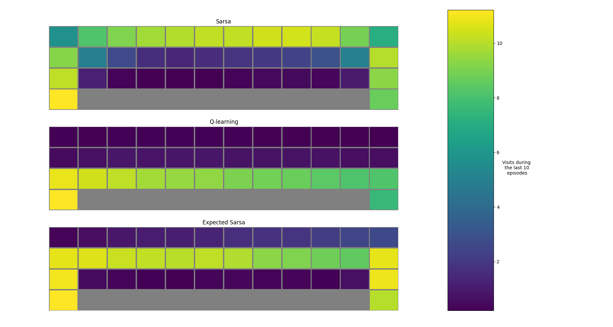

# RL Exercises
Exercises for reinforcement learning.

## Requirements
- numpy
- gym

## Exercises List
- bandits & greedy epsilon
- gridworld & bellman equation
- cliffworld & policy/value iteration
- ...

You can find examples in [run](./run) folder. Some results are shown in [pictures](./pictures) folder. For example, [./pictures/exp6/exp6_2.png](./pictures/exp6/exp6_2.png) shows the result of different methods in a cliffworld:

## Reference
- [Coursera - Reinforcement Learning Specialization](https://www.coursera.org/specializations/reinforcement-learning)
- [Reinforcement Learning: An Introduction](http://www.incompleteideas.net/book/the-book.html)
